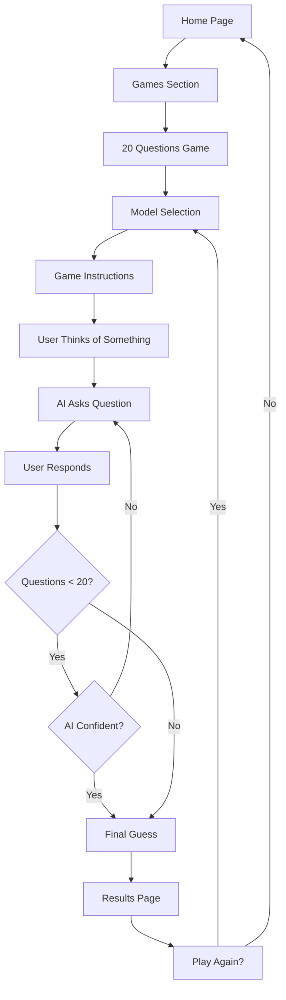

# 20 Questions Game with Keywords AI Integration - Product Requirements Document

## 1. Product Overview

A web-based "20 Questions" game where an AI assistant powered by Keywords AI attempts to guess what the user is thinking by asking strategic yes/no questions. The game leverages advanced LLM capabilities through Keywords AI's gateway to provide an engaging and intelligent guessing experience.

The product solves the challenge of creating interactive AI experiences that demonstrate the reasoning capabilities of modern language models while providing entertainment value. Target users include AI enthusiasts, developers exploring LLM capabilities, and general users seeking interactive entertainment.

## 2. Core Features

### 2.1 User Roles

No role distinction is necessary for this game - all users have the same access and functionality.

### 2.2 Feature Module

Our 20 Questions game consists of the following main pages:

1. **Home page**: Enhanced with navigation bar, game access button, existing content sections.
2. **Game page**: Game interface, question display, response buttons, progress tracking, game state management.
3. **Game results page**: Final guess display, confidence level, game summary, play again option.

### 2.3 Page Details

| Page Name         | Module Name           | Feature description                                                                                                  |
| ----------------- | --------------------- | -------------------------------------------------------------------------------------------------------------------- |
| Home page         | Navigation bar        | Add top navigation with "Games" button linking to game page                                                          |
| Home page         | Game section          | Add new section showcasing the 20 Questions game with preview                                                        |
| Game page         | Game initialization   | Start new game, display instructions, model selection (OpenAI 4o mini, Anthropic Haiku 3.5, Google Gemini 2.5 Flash) |
| Game page         | Question display      | Show current AI question clearly, display question counter (X/20)                                                    |
| Game page         | Response interface    | Three large buttons: "Yes", "No", "Maybe/Sometimes" for user responses                                               |
| Game page         | Progress tracking     | Visual progress bar, questions remaining counter, conversation history                                               |
| Game page         | Game state management | Track all questions and answers, manage game flow, handle edge cases                                                 |
| Game results page | Final guess display   | Show AI's final guess with confidence percentage                                                                     |
| Game results page | Game summary          | Display conversation history, show reasoning process                                                                 |
| Game results page | New game controls     | "Play Again" button, "Change Model" option, return to home                                                           |

## 3. Core Process

### Main User Flow

1. User visits home page and clicks "Games" in navigation
2. User selects 20 Questions game and chooses AI model
3. User thinks of something (object, person, place, concept)
4. AI asks strategic questions (starting broad, getting specific)
5. User responds with Yes/No/Maybe to each question
6. Game continues until 20 questions asked or AI is confident
7. AI makes final guess with confidence level
8. User sees results and can start new game



## 4. User Interface Design

### 4.1 Design Style

* **Primary colors**: Slate-700 (#334155), Gray-200 (#E5E7EB)

* **Secondary colors**: Blue-600 (#2563EB), Green-600 (#059669), Red-600 (#DC2626)

* **Button style**: Rounded corners (8px), subtle shadows, hover animations

* **Font**: Geist Sans for headings, system fonts for body text

* **Layout style**: Card-based design, centered content, responsive grid

* **Icons**: Heroicons for consistency, question mark and lightbulb emojis

### 4.2 Page Design Overview

| Page Name         | Module Name          | UI Elements                                                                      |
| ----------------- | -------------------- | -------------------------------------------------------------------------------- |
| Home page         | Navigation bar       | Fixed top nav, logo left, "Games" button right, slate-700 background             |
| Home page         | Game preview section | Card layout, game screenshot, description, "Play Now" CTA button                 |
| Game page         | Game header          | Progress bar (blue), question counter, model indicator                           |
| Game page         | Question display     | Large card, centered text, question mark icon, clean typography                  |
| Game page         | Response buttons     | Three equal-width buttons: green (Yes), red (No), yellow (Maybe)                 |
| Game page         | History sidebar      | Collapsible panel, previous Q\&A pairs, scroll for long conversations            |
| Game results page | Guess card           | Large centered card, AI guess, confidence meter, celebration/consolation message |
| Game results page | Summary section      | Expandable conversation history, reasoning insights, statistics                  |

### 4.3 Responsiveness

Desktop-first design with mobile-adaptive layout. Touch-optimized button sizes (minimum 44px) for mobile devices. Responsive grid system adjusts from 3-column desktop to single-column mobile layout.

## 5. Technical Implementation

### 5.1 Keywords AI Integration

Following the Vercel AI SDK integration pattern:

* API endpoint: `/api/games/20-questions/ask`

* Environment variable: `KEYWORDS_AI_API_KEY`

* Supported models: OpenAI GPT-4o mini, Anthropic Claude Haiku 3.5, Google Gemini 2.5 Flash

* Request logging through Keywords AI gateway

### 5.2 Prompt Strategy

The AI prompt should be created in Keywords AI platform with the following structure:

**Prompt Name**: "20-Questions-Game-Master"

**Prompt Template**:

```
You are playing a 20 Questions game. Your goal is to guess what the human is thinking of by asking strategic yes/no questions.

Rules:
- Ask only YES/NO questions
- You have maximum {{max_questions}} questions
- Start with broad categories, then get specific
- User can answer: "Yes", "No", or "Maybe/Sometimes"
- Make your final guess when confident or when questions run out

Current game state:
- Questions asked: {{questions_asked}}/{{max_questions}}
- Previous Q&A: {{conversation_history}}

Based on the conversation so far, ask your next strategic question. If you're confident about the answer or have used all questions, make your final guess instead.

Format your response as either:
- QUESTION: [your question]
- GUESS: [your final guess] (Confidence: X%)
```

**Variables**:

* `max_questions`: 20

* `questions_asked`: Current question count

* `conversation_history`: JSON array of previous questions and answers

### 5.3 File Structure

```
src/
├── app/
│   ├── games/
│   │   └── 20-questions/
│   │       ├── page.tsx
│   │       └── results/
│   │           └── page.tsx
│   └── api/
│       └── games/
│           └── 20-questions/
│               └── ask/
│                   └── route.ts
├── components/
│   ├── navigation/
│   │   └── TopNavBar.tsx
│   └── games/
│       └── twenty-questions/
│           ├── GameInterface.tsx
│           ├── QuestionDisplay.tsx
│           ├── ResponseButtons.tsx
│           ├── ProgressTracker.tsx
│           └── GameResults.tsx
└── types/
    └── games.ts
```

### 5.4 Dependencies Required

* `ai`: Vercel AI SDK

* `@ai-sdk/openai`: OpenAI integration

* `@ai-sdk/anthropic`: Anthropic integration

* `@ai-sdk/google`: Google integration

### 5.5 Environment Variables

```
KEYWORDS_AI_API_KEY=your_keywords_ai_api_key
NEXT_PUBLIC_APP_URL=http://localhost:3000
```

## 6. Game Logic Specifications

### 6.1 Question Strategy

1. **Broad categorization** (Questions 1-5): Living vs non-living, tangible vs abstract
2. **Category refinement** (Questions 6-12): Specific categories like animal, object, person, place
3. **Attribute drilling** (Questions 13-18): Size, color, function, location, time period
4. **Final narrowing** (Questions 19-20): Specific characteristics for final guess

### 6.2 Confidence Calculation

AI should make final guess when:

* Confidence level reaches 80% or higher

* 20 questions have been asked

* User provides contradictory answers (edge case handling)

### 6.3 Edge Case Handling

* **Unclear answers**: Ask for clarification within question limit

* **Contradictory responses**: Note inconsistency and adjust strategy

* **Abstract concepts**: Adapt questioning for non-physical entities

* \*\*Multiple

